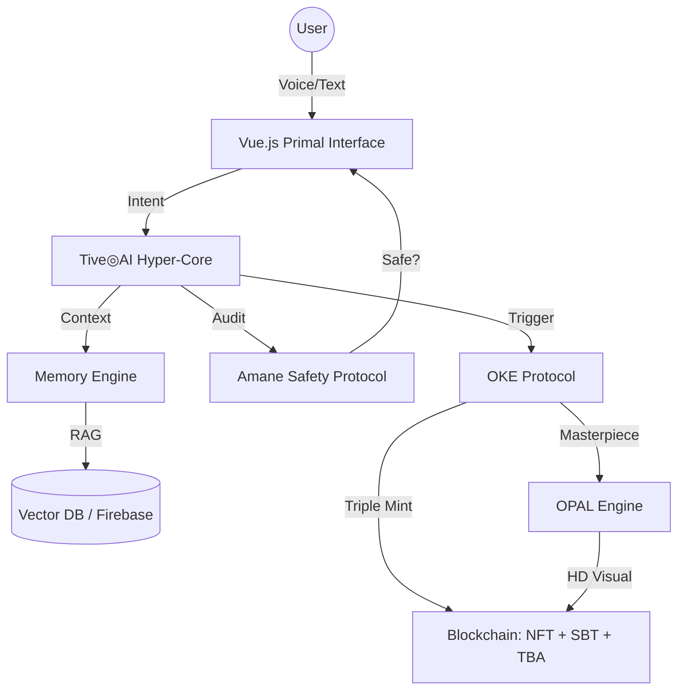

# AIM　Web3 Fullstack
<AI Voice Memo & OKE web3 crypto cards>
This directory contains the fully integrated AIM3 application combining AI (Gemini), Web3 (Solidity), and Physics (Antigravity Engine)＆ Tive◎AI.

## Directory Structure 
- **frontend/**: (Root/src) Vue.js application with Antigravity Engine and MintPanel.
- **backend/**: Node.js Express API handling Atomic Minting and IPFS.
- **contracts/**: Solidity Smart Contracts (AtomicMint.sol, OKE_NFT.sol, SBT.sol).
- **scripts/**: Deployment scripts for the blockchain layer.

## Quick Start

### 1. Contracts
Deploy the contracts to your preferred network (or local node).
```bash
npx hardhat run scripts/deploy.js
```
Copy the resulting addresses to `.env` in `backend/`.

### 2. Backend
Start the Atomic Mint API.
```bash
cd backend
npm install
npm start
```

### 3. Frontend
Start the AIM UI.
```bash
npm install
npm run dev
```

## Features
- **Atomic Mint**: One-click parallel minting of NFT + SBT + TBA.
- **Tive◎AI (Guardianship Layer)**: An evolution of AI into a "Mimamori" (Gentle Care) presence.
    - **Protective Monitoring**: Real-time signal analysis that auto-stops recording after 7s of silence or 180s to protect user privacy.
    - **Amane Ethics Engine**: Intelligence rooted in Privacy Sovereignty, Empathy, and Soul Protection.
- **Antigravity Engine**: Physics-based UI that reacts to AI emotions with a "Sacred Organic" aesthetic.
- **Privacy Shield**: "Data Sovereignty" defense protocol ensuring high-vibrational data integrity.

## 📐 System Architecture



### 🧠 Tive◎AI Cognitive Architecture (Deep Dive)
The **HyperCore (Python)** implements a 10-module neural pipeline using **Gemini 1.5 Flash** and **SentenceTransformers** for persistent, stateful cognition:

1.  **Memory Scorer**: Dynamically ranks text importance based on length, emotional intensity, and repetition.
2.  **Relation Builder**: Uses `all-MiniLM-L6-v2` embeddings to construct semantic links between memory nodes (Cosine Similarity > 0.75).
3.  **Causal Inference**: An LLM-driven loop that deduces if a current thought was triggered by a specific historical memory.
4.  **Goal Tracker (North Star)**: Extracts long-term intentions and injects them into the AI's system prompt for persistent alignment.
5.  **Belief Revision**: Dynamically updates the confidence levels of previous memories when contradictory "truth" is provided.
6.  **Introspection Engine**: A self-reflection loop that evaluates if the AI's previous response was optimal based on user reaction.
7.  **Forgetting Engine**: Implements a time-based decay function (TTL) to prune low-importance nodes, ensuring GDPR compliance.
8.  **Context Composer**: Reconstructs a high-fidelity context string from the most relevant and high-confidence nodes.
9.  **Persona Stabilizer**: Enforces consistency in tone and emotional resonance (Mimamori presence).
10. **Self-Improver**: Final-stage autonomous refinement to ensure clarity and Socratic value.

### 💎 OKE Protocol: Triple Minting Logic
The **OKE (Observed Knowledge Exchange)** protocol anchors significant AI interactions on-chain:
- **NFT (Visual Fact)**: Persistent visual insight, enhanced by the **OPAL** engine for HD resonance.
- **SBT (Soulbound Token)**: Non-transferable proof of growth or identity.
- **TBA (Token Bound Account)**: Autonomous wallet (ERC-6551) allowing artifacts to "own" assets.

### 🛡️ Amane Peace Protocol (Compliance Layer)
Rooted in the *Amane Safety Framework*, this layer ensures that AI evolution remains beneficial and protected.

- **Real-Time Auditing (Broad Listening)**: Multi-agent checks both user intent and AI output for violations.
- **Anti-Sycophancy**: Detects and corrects over-agreement to ensure objective and balanced guidance.
- **Ironclad Taboos**: Hard-coded refusal of **War** (Geneva Convention), **Fraud**, **Harm**, **Fakes**, and **Spying**.
- **Compliance Headers**: Every interaction is tagged with compliance metadata (`X-Amane-Privacy`, `X-Amane-Ethics`).
- **Socratic Scaffolding**: Functions as a facilitator rather than an oracle, guiding users toward their own truth.

### 🌌 Antigravity Physics Engine (UX/UI Resonance)
The **Antigravity Engine** (`src/engine/antigravity-engine.js`) isn't just decoration; it's a physical representation of Tive◎AI's internal state:
- **Emotional Mapping**: The engine's `glowState` and `particleColor` sync with the AI's `emotion` score (e.g., #FF8B8B for High-Energy/Sacred resonance).
- **Physical Feedback**: `Gravity` and `Reactivity` parameters adjust based on the AI's focus level, creating a "living" UI that breathes and pulses with the conversation.
- **Mint Celebration**: A kinetic explosion of particles triggers upon successful blockchain minting, providing immediate physical feedback for on-chain events.

## 🛠️ Development Workflow (Unified Launch)

To launch the entire AIM3 ecosystem (Frontend, Backend, and AI Core):

### 1. Requirements
- **Frontend/Backend**: Node.js 18+, npm
- **AI Core**: Python 3.10+, `pip install fastapi uvicorn google-generativeai sentence-transformers`

### 2. Launch Commands
```bash
# Terminal 1: AI Hyper-Core
python main.py

# Terminal 2: Node.js Backend
cd backend && npm start

# Terminal 3: Vue Frontend
npm run dev
```

### Integrated Ports:
- **Frontend (Vite)**: `http://localhost:5173`
- **Backend (Node.js)**: `http://localhost:3000`
- **AI Hyper-Core (Python)**: `http://localhost:8000`

> [!IMPORTANT]
> Ensure `GEMINI_API_KEY` is set in your environment or `.env` file for both the Python Hyper-Core and the Node.js backend.

## 📡 HyperCore API Reference

### `POST /api/chat`
The main entry point for the Tive◎AI cognitive loop.
- **Input**: `{ user_id: string, text: string, previous_ai_response: string }`
- **Output**: `{ success: boolean, response: string, meta: { emotion, resonance, relations_count } }`
- **Logic**: Input Audit → Cognitive Parallel Tasks → Memory Graph Update → Response Synthesis → Output Audit.

### `GET /core-status` (via Backend Proxy)
The Node.js backend proxies this request to the Python Hyper-Core's root to verify active compliance protocols.

## 📈 System Roadmap

- [x] **Phase 1: Cognitive Foundation**: 10-module memory engine (HyperCore v2).
- [x] **Phase 2: Broad Listening**: Multi-agent LLM-based auditing for sub-perceptual safety checks (Active).
- [ ] **Phase 3: Cross-chain Synthesis**: Bridging OKE artifacts from Sepolia to high-speed L2s (Base/Optimism) for near-instant "Physical" artifacts.
- [ ] **Phase 4: Autonomous TBAs**: Enabling Token Bound Accounts to autonomously manage "North Star" goals using sub-wallets.
- [ ] **Phase 5: Galactic Resonance**: Scaling the Amane Protocol to multi-user "Sanctuary" environments.

## 📜 License & Ethics
This project is licensed under the **Amane Peace License (APL)**. 
Usage in kinetic war operations or tactical military intelligence is strictly prohibited by hard-coded neural logic.

---
*Amane Protocol Version: 2.2.0-RESONANCE*
*Status: High-Resonance Active*
*Last Synchronized: 2026-03-02*

